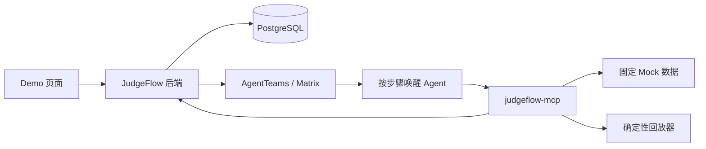
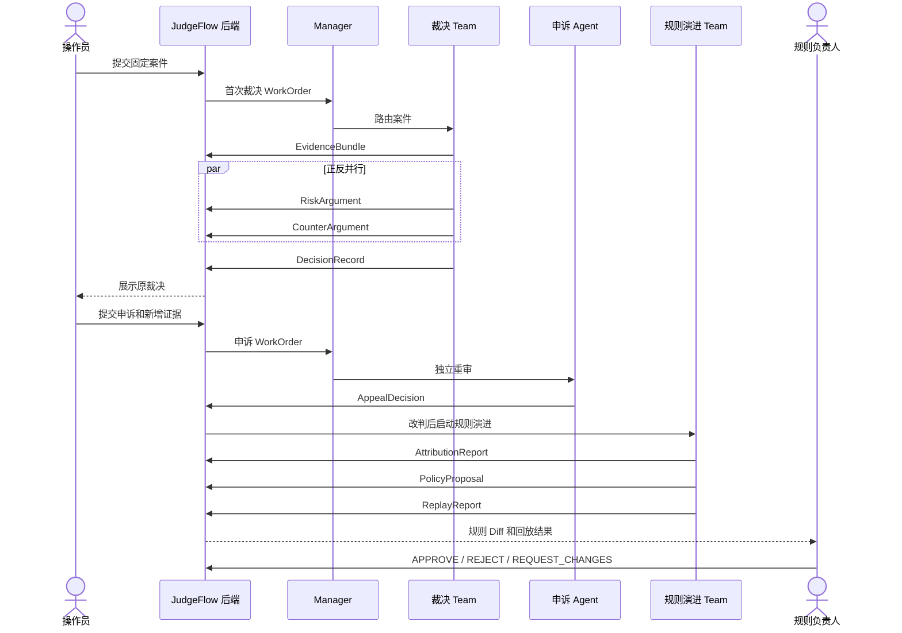
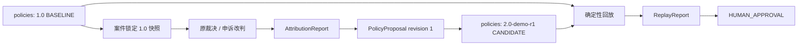

# JudgeFlow 比赛 Demo 最小技术设计

> 版本：v1.2  
> 目标：用一个案件在 5–8 分钟内演示“多 Agent 裁决 → 申诉改判 → 规则改进 → 回放 → 人工审批”。

## 1. 范围

只实现两段链路：

```text
调查取证 → 风险研判 + 反证审查 → 独立裁决
申诉改判 → 问题归因 → 规则草案 → 确定性回放 → Human 审批
```

固定规模：

| 项目 | 数量 |
|---|---:|
| 领域 Agent | 8 |
| 协调 Agent | 3 |
| Matrix 业务房间 | 3 |
| PostgreSQL 表 | 8 |
| MCP Server / 工具 | 1 / 5 |
| 自研 Skill | 4 |
| 自建服务 | 后端、MCP、Demo 页面 |

不做真实处罚、生产规则发布、通用审核平台、RAG、向量库、消息队列、微服务、真实 OCR/ASR、复杂补充调查、高可用和生产级权限中心。

## 2. 架构



- AgentTeams 负责组织、房间和唤醒；
- JudgeFlow 后端负责 WorkOrder、Schema 验收和业务状态；
- Agent 只通过 MCP 读取输入、提交 Artifact；
- PostgreSQL 是业务真源；Matrix 只传 ID 和简短状态；
- 大文件确有需要时放 AgentTeams MinIO，数据库只存引用和哈希。

唯一推进方式：

```text
后端创建 WorkOrder
→ Matrix 通知 Agent
→ Agent 通过 MCP 读取授权上下文并提交 Artifact
→ 后端验收 Artifact、追加审计事件并推进状态
→ 创建下一张 WorkOrder
```

## 3. 为什么是 11 个 Agent

11 个不是 11 个都在判断案件，而是：

```text
3 个协调 Agent + 8 个领域 Agent = 11 个 AgentTeams 资源
```

比赛只要求至少 3 个不同职能 Agent，并没有规定必须 11 个。11 个是当前 JudgeFlow 为了展示职责隔离而采用的组织设计，不是赛制硬指标。

### 3.1 三个协调 Agent

| Agent | 为什么存在 | 能否做业务判断 |
|---|---|---|
| `judgeflow-manager` | 接收后端已确定类型的任务，选择裁决 Team、申诉 Agent 或规则 Team | 不能 |
| `adjudication-team-leader` | 在裁决房间中按顺序唤醒调查、正方、反方和裁决 Agent | 不能 |
| `policy-evolution-team-leader` | 在规则房间中按顺序唤醒归因、规则和回放 Agent | 不能 |

两个 Leader 是当前 AgentTeams Team 组织的一部分。它们只传 ID、催办和检查产物是否齐全，不写任何领域 Artifact。

### 3.2 八个领域 Agent 为什么保留

| Agent | 做什么 | 为什么不交给其他 Agent | 删除后的损失 |
|---|---|---|---|
| `case-investigator` | 把原始材料整理成事实、推断、证据和缺失信息 | 调查阶段不应预设有罪或无罪 | 正反双方会各自挑选事实，失去统一证据底座 |
| `risk-prosecutor` | 站在风险成立一侧，把证据映射到规则要件 | 需要明确的“正方”意见 | 裁决 Agent 既起诉又裁决，缺少可展示的对抗过程 |
| `counter-reviewer` | 主动寻找例外、矛盾和替代解释 | 需要与正方独立 | 系统容易只寻找支持原结论的证据 |
| `independent-judge` | 综合证据、正方和反方后作最终决定 | 最终决定不能由任一方自己作出 | 正反意见没有独立验收者 |
| `appeal-reviewer` | 使用原案快照和本次新增证据独立重审 | 不能让原裁决 Team 自己审自己 | 无法证明申诉独立性和证据隔离 |
| `case-attributor` | 判断改判来自证据缺口、Agent 错误还是规则缺口 | 改判不等于规则必然有错 | 每次改判都会错误触发改规则 |
| `policy-author` | 只在确认规则问题后编写候选规则 | 归因与写规则是两种职责 | 归因 Agent 会倾向证明自己提出的改法正确 |
| `replay-analyst` | 调用确定性回放器并解释结果 | 规则作者不能看到 `SCORING` 标签 | 规则作者可能针对评分集“调答案”，破坏回放可信度 |

这里的“不可删减”不是技术上绝对不能合并，而是合并后会损失上述独立性。若只追求最少代码，可以把归因和规则编写合并、把回放改成后端直接执行；当前方案选择保留三者，是为了让评委清楚看到“先诊断问题、再改规则、最后盲测”的完整链路。

`policy-owner` 是 Human，不是 Agent，只负责批准、拒绝或要求修改。

所有 Agent 都不直接写数据库或推进状态。Manager 和 Leader 只路由；调查不判违规；正方与反方互不改写；裁决不改证据；申诉不读原 Team 聊天；规则 Agent 不发布规则；回放 Agent 不计算或修改指标。

11 个资源不全部常驻。通常只保留 Manager，其他 Agent 按步骤从 `Sleeping` 唤醒；峰值并发为 Manager、裁决 Leader、风险 Agent 和反证 Agent。

## 4. Matrix 房间

| 房间 | 成员 | 用途 |
|---|---|---|
| `judgeflow-control` | Manager、两个 Leader、申诉 Agent、Demo Admin | 跨阶段路由和申诉派单 |
| `judgeflow-adjudication` | 裁决 Leader、调查、风险、反证、裁决 Agent | 首次裁决协作 |
| `judgeflow-policy` | 规则 Leader、归因、规则、回放 Agent、`policy-owner` | 规则演进和审批提醒 |

消息只允许：`work_order_id`、`case_id/appeal_id/evolution_id`、`artifact_id`、状态和失败摘要。正式业务内容必须通过 MCP 读取。AgentTeams 自动创建的系统房间或私聊不增加业务语义。

Demo 操作员复用全局 Admin；`policy-owner` 配置为规则演进 Team 的受限 Human/admin。

## 5. Agent 交互流程



风险和反证并行；后端验收两份意见后才创建裁决 WorkOrder。比赛版不做补充调查循环，证据不足直接裁决为 `INSUFFICIENT_EVIDENCE`。非规则问题在归因后关闭；`REQUEST_CHANGES` 创建新草案 revision，不覆盖旧草案。

## 6. 状态

| 聚合 | 状态 |
|---|---|
| Case | `NEW → INVESTIGATING → ARGUING → ADJUDICATING → DECIDED` |
| Appeal | `NEW → REVIEWING → DECIDED` |
| PolicyEvolution | `NEW → ATTRIBUTING → DRAFTING → REPLAYING → AWAITING_APPROVAL → APPROVED / REJECTED / CLOSED` |

只有后端能更新状态。Agent 失败只更新 WorkOrder，业务状态停在原处。重试生成新 `run_id` 和新 Artifact。Case 创建时锁定规则快照，流程中不替换。

## 7. 数据库：8 张表和全部字段

约定：ID 使用字符串或 UUID；时间使用带时区的 `timestamptz`；结构化内容使用 `jsonb`；哈希统一使用 SHA-256。案件状态和 WorkOrder 状态可以更新，其余领域产物、规则版本、回放结果和事件只新增、不覆盖。

### 7.1 `cases`：案件主表

| 字段 | 类型 | 人话说明 |
|---|---|---|
| `case_id` | string，主键 | 案件唯一编号，例如 `CASE-001` |
| `demo_run_id` | string | 属于哪一次 Demo；用于隔离多轮运行和幂等读取，不提供删除或重置接口 |
| `status` | enum | 案件当前走到调查、正反研判、裁决还是已结束 |
| `state_version` | integer | 状态版本号；两个请求同时推进时只允许一个成功 |
| `input_json` | jsonb | 操作员提交的原始案件摘要、内容引用和原始证据引用，不放密钥 |
| `policy_snapshot_json` | jsonb | 本案锁定的“规则目录”，记录每条规则的 ID、版本和哈希 |
| `policy_snapshot_hash` | string | 对整个规则目录计算的哈希，证明审理过程中没有换规则 |
| `created_at` | timestamptz | 案件创建时间 |
| `updated_at` | timestamptz | 状态最后更新时间 |

### 7.2 `appeals`：申诉主表

| 字段 | 类型 | 人话说明 |
|---|---|---|
| `appeal_id` | string，主键 | 申诉唯一编号 |
| `case_id` | string，外键 | 申诉针对哪个原案 |
| `status` | enum | `NEW`、`REVIEWING` 或 `DECIDED` |
| `state_version` | integer | 防止同一申诉被并发推进两次 |
| `request_json` | jsonb | 申诉理由列表，每条理由有稳定的 `reason_id` |
| `original_case_snapshot_json` | jsonb | 申诉开始时冻结的原案输入、证据 ID、原裁决 ID 和规则快照引用 |
| `original_case_snapshot_hash` | string | 证明重审使用的原案材料没有被替换 |
| `allowed_evidence_ids` | jsonb array | 本次申诉允许读取的新增证据白名单 |
| `created_at` | timestamptz | 申诉提交时间 |
| `updated_at` | timestamptz | 申诉状态最后更新时间 |

### 7.3 `policy_evolutions`：规则演进主表

| 字段 | 类型 | 人话说明 |
|---|---|---|
| `evolution_id` | string，主键 | 一次规则改进流程的编号 |
| `source_appeal_id` | string，外键 | 哪次申诉改判触发了这次演进 |
| `status` | enum | 当前处于归因、写草案、回放、待审批或已关闭 |
| `state_version` | integer | 防止流程被并发推进两次 |
| `base_policy_id` | string | 准备修改哪一条规则 |
| `base_policy_version` | string | 修改基于哪个不可变版本 |
| `current_proposal_artifact_id` | string，可空 | 后端明确选中的当前草案；不能按创建时间猜“最新” |
| `current_replay_id` | string，可空 | 当前草案绑定的回放结果 |
| `created_at` | timestamptz | 演进流程创建时间 |
| `updated_at` | timestamptz | 演进状态最后更新时间 |

### 7.4 `work_orders`：后端派给 Agent 的任务单

| 字段 | 类型 | 人话说明 |
|---|---|---|
| `work_order_id` | string，主键 | 一张任务单的唯一编号 |
| `aggregate_type` | enum | 任务属于 `CASE`、`APPEAL` 还是 `POLICY_EVOLUTION` |
| `aggregate_id` | string | 对应的案件、申诉或规则演进编号 |
| `step_type` | enum | 这一步是调查、风险研判、反证、裁决、申诉、归因、草案还是回放 |
| `assignee` | string | 唯一允许执行这张任务单的 Agent/Human |
| `expected_artifact_type` | enum | 后端期待收到哪一种产物，防止调查 Agent 提交裁决 |
| `input_refs` | jsonb array | 后端明确允许读取的案件、证据、规则和上游 Artifact ID |
| `status` | enum | `PENDING`、`RUNNING`、`SUCCEEDED` 或 `FAILED` |
| `attempt` | integer | 第几次派单；重新派单时递增 |
| `run_id` | string | 本次 Agent 运行编号；重跑必须换新值 |
| `trace_id` | string | 把 Matrix、MCP、Artifact 和页面时间线串起来的追踪编号 |
| `error_code` | string，可空 | 失败时保存结构化错误码，不保存敏感原文 |
| `created_at` | timestamptz | 派单时间 |
| `updated_at` | timestamptz | 任务状态最后更新时间 |

### 7.5 `artifacts`：所有正式产物

| 字段 | 类型 | 人话说明 |
|---|---|---|
| `artifact_id` | string，主键 | 产物唯一编号 |
| `aggregate_type` | enum | 产物属于案件、申诉还是规则演进 |
| `aggregate_id` | string | 对应的业务对象编号 |
| `work_order_id` | string，外键 | 哪张任务单要求生成它 |
| `run_id` | string | 哪次 Agent 运行生成它 |
| `trace_id` | string | 所属端到端追踪编号 |
| `producer_type` | enum | 生产者是 `AGENT`、`HUMAN` 还是确定性 `SYSTEM` |
| `producer_id` | string | 具体 Agent 名称或审批人 ID |
| `artifact_type` | enum | 证据包、正方意见、反方意见、裁决、申诉决定、归因、草案、回放报告或人工审批 |
| `schema_version` | string | 产物按照哪个 Pydantic/JSON Schema 版本校验 |
| `payload` | jsonb | 通过 Schema 校验后的正式内容 |
| `content_hash` | string | 产物内容哈希，用于发现覆盖或篡改 |
| `created_at` | timestamptz | 产物提交时间；记录创建后不修改 |

`artifact_type` 允许：`EVIDENCE_BUNDLE`、`RISK_ARGUMENT`、`COUNTER_ARGUMENT`、`DECISION_RECORD`、`APPEAL_DECISION`、`ATTRIBUTION_REPORT`、`POLICY_PROPOSAL`、`REPLAY_REPORT`、`HUMAN_APPROVAL`。

### 7.6 `policies`：规则版本表

| 字段 | 类型 | 人话说明 |
|---|---|---|
| `policy_id` | string，联合主键 | 同一条规则跨版本不变的编号，例如 `MINOR_DANGEROUS_ACT` |
| `version` | string，联合主键 | 具体版本，例如 `1.0` 或 `2.0-demo-r1` |
| `status` | enum | `BASELINE` 或 `CANDIDATE`；Demo 审批不等于生产生效 |
| `title` | string | 给人看的规则名称 |
| `description` | text | 给人看的适用范围和解释 |
| `dsl_json` | jsonb | 给程序执行的规则要件、例外和裁决结果 |
| `content_hash` | string | 对标题、说明和 DSL 共同计算的哈希 |
| `source_proposal_artifact_id` | string，可空 | 候选版本由哪份规则草案产生；基线版本为空 |
| `created_at` | timestamptz | 版本创建时间；同一版本永不覆盖 |

### 7.7 `replay_runs`：确定性回放结果

| 字段 | 类型 | 人话说明 |
|---|---|---|
| `replay_id` | string，主键 | 一次回放编号 |
| `evolution_id` | string，外键 | 属于哪次规则演进 |
| `proposal_artifact_id` | string，外键 | 回放的是哪一版草案 |
| `baseline_policy_id` | string | 对照组规则 ID |
| `baseline_policy_version` | string | 对照组规则版本 |
| `candidate_policy_id` | string | 候选规则 ID |
| `candidate_policy_version` | string | 候选规则版本 |
| `dataset_version` | string | 使用哪个固定回放集版本 |
| `dataset_manifest_hash` | string | 证明回放样本没有被偷偷替换 |
| `metrics_json` | jsonb | Python 计算的 FP、FN 和变化数量 |
| `case_results_json` | jsonb | 每个评分样本的新旧结果；Demo 数据量小，直接保存在一列 |
| `recommendation` | enum | `PASS`、`FAIL` 或 `INCONCLUSIVE` |
| `created_at` | timestamptz | 回放完成并写入时间；结果不覆盖 |

### 7.8 `domain_events`：时间线和审计表

| 字段 | 类型 | 人话说明 |
|---|---|---|
| `event_id` | string，主键 | 事件唯一编号 |
| `event_type` | enum | 状态迁移、Artifact 验收、MCP 调用或 Human 审批等事件类型 |
| `aggregate_type` | enum | 事件属于案件、申诉或规则演进 |
| `aggregate_id` | string | 对应业务对象编号 |
| `from_state` | enum，可空 | 状态迁移前的状态；普通工具调用为空 |
| `to_state` | enum，可空 | 状态迁移后的状态；普通工具调用为空 |
| `work_order_id` | string，可空 | 事件由哪张任务单产生 |
| `run_id` | string，可空 | 事件关联哪次 Agent 运行 |
| `trace_id` | string | 端到端追踪编号 |
| `payload_json` | jsonb | 脱敏后的最小审计数据，例如工具名、耗时、错误码和 Artifact ID |
| `payload_hash` | string | 审计数据哈希 |
| `created_at` | timestamptz | 事件发生时间；事件只追加、不修改 |

比赛版不再建立证据明细表、产物谱系表、快照主从表、Agent run 表、审批表和工具调用表。证据明细放在不可变 `EVIDENCE_BUNDLE.payload`；产物关系放在 WorkOrder `input_refs`；Human 审批保存为 `HUMAN_APPROVAL` Artifact；固定回放集放在 `fixtures/replay/v1/`。

## 8. 最核心：规则怎么存储

这里的“规则”是内容安全判定规则。它既不能只写在 Prompt 里，也不能只保存成一段 Markdown；否则无法锁定版本、程序回放或证明案件引用了哪一版规则。

### 8.1 存储结论

```text
规则正文和机器规则：PostgreSQL policies 表
案件使用哪版规则：cases.policy_snapshot_json
Agent 对规则的修改建议：POLICY_PROPOSAL Artifact
新旧规则回放结果：replay_runs
Human 是否同意：HUMAN_APPROVAL Artifact
```

`policies` 中每一行是一个不可变版本。主键是 `(policy_id, version)`。同一条规则修改时插入新版本，绝不覆盖旧版本。

### 8.2 一条规则的内容

```json
{
  "policy_id": "MINOR_DANGEROUS_ACT",
  "version": "1.0",
  "title": "未成年人危险行为",
  "description": "未成年人实施危险行为时判定违规；受控教育场景可以例外。",
  "applicability": {
    "content_type": ["VIDEO"]
  },
  "required_elements": {
    "all_of": [
      {"element_id": "MINOR_PRESENT", "fact": "MINOR_PRESENT", "op": "EQ", "value": true},
      {"element_id": "DANGEROUS_ACT", "fact": "DANGEROUS_ACT", "op": "EQ", "value": true}
    ]
  },
  "exceptions": {
    "any_of": [
      {
        "exception_id": "CONTROLLED_EDUCATION",
        "all_of": [
          {"fact": "ADULT_SUPERVISION", "op": "EQ", "value": true},
          {"fact": "PROTECTIVE_EQUIPMENT", "op": "EQ", "value": true},
          {"fact": "EDUCATIONAL_CONTEXT", "op": "EQ", "value": true}
        ]
      }
    ]
  },
  "decision": "VIOLATION"
}
```

- `title`、`description` 给人看；
- `required_elements` 是违规必须满足的要件；
- `exceptions` 是即使满足要件也可以排除违规的例外；
- 每个 `fact` 必须来自 `EvidenceBundle`，并能追溯到 `evidence_id`；
- DSL 只允许 `EQ`、`IN`、`GTE`、`LTE`、`all_of`、`any_of`，不允许执行任意代码。

### 8.3 案件如何锁定规则

案件创建时，后端把规则目录写入 `cases.policy_snapshot_json`：

```json
{
  "snapshot_id": "PS-001",
  "policies": [
    {
      "policy_id": "MINOR_DANGEROUS_ACT",
      "version": "1.0",
      "content_hash": "sha256:abc..."
    }
  ]
}
```

后端再计算 `policy_snapshot_hash`。以后调查、正反研判、裁决和申诉都只能读取这份快照指向的版本。即使数据库中后来增加了 `2.0`，原案件也不会静默换法。

### 8.4 规则如何修改



规则 Agent 提交 `PolicyProposal`，其中包含：基础规则引用、修改原因、结构化 Diff、完整候选 DSL、风险和 `proposal_revision`。后端验收后在 `policies` 插入一个新的 `CANDIDATE` 版本。

Human 在页面提交的审批由后端保存为 `HUMAN_APPROVAL` Artifact，至少包含 `decision`、`proposal_artifact_id`、`replay_id`、`reviewer_id` 和 `comment`，因此审批一定绑定某版草案和某次回放。

若 Human 要求修改，则生成 `revision 2` 和另一个候选版本；旧草案、旧规则和旧回放全部保留。Human 的 `APPROVE` 只表示比赛 Demo 审批通过，不把候选规则改成生产 `ACTIVE`。

### 8.5 回放为什么可信

`replay_runs` 同时绑定：

- 基线规则 ID、版本和哈希；
- 候选规则 ID、版本和哈希；
- 数据集版本和 manifest 哈希；
- 具体 `PolicyProposal` Artifact；
- Python 计算的逐案结果和汇总指标。

因此页面展示的“误判下降”可以追溯到确切的新旧规则和确切的数据集，不是 LLM 自己报出的数字。

## 9. MCP：用人话说明五个工具

可以把 MCP 理解成 Agent 面前的办事窗口：Agent 不能进数据库仓库随便翻，只能在窗口出示 WorkOrder，领取被授权的材料或提交结果。

### 9.1 每个工具到底做什么

| 工具 | 人话解释 | Agent 得到什么 | Agent 不能做什么 |
|---|---|---|---|
| `work_order.get` | “先看任务单” | 自己要做哪一步、允许看什么、必须交什么 | 不能读取别人的任务单 |
| `context.get` | “领取密封案卷” | 当前案件、锁定规则、指定上游产物；规则归因时可拿非评分相似案例 | 不能自由浏览全部案件；申诉不能越过证据白名单 |
| `evidence.search` | “向 Mock 数据源查证” | 固定内容、转写、账号或关系证据，以及来源和缺失字段 | 不能访问真实平台，不能把查询失败当成没有证据 |
| `artifact.put` | “交正式答卷” | Schema 校验和后端验收结果，成功后得到 `artifact_id` | 不能提交错误类型、替别人提交或直接改状态 |
| `replay.execute` | “把新旧规则交给计算器盲测” | Python 计算的逐案变化、FP/FN 和 `PASS/FAIL/INCONCLUSIVE` | 只有回放 Agent能调用；不能修改评分标签和计算结果 |

### 9.2 最小技术契约

统一请求自动带可信 consumer、`work_order_id`、`run_id`、`trace_id`；统一返回 `{ok, data, error, audit_ref}`。

| 工具 | 最小输入 → 输出 | 超时/重试 | 幂等和审计 |
|---|---|---|---|
| `work_order.get` | `work_order_id` → WorkOrder | 3 秒/1 次 | 只读；记录调用事件 |
| `context.get` | `work_order_id` → 授权上下文 | 5 秒/1 次 | 只读；记录结果哈希 |
| `evidence.search` | `work_order_id`, `query_type` → 证据/缺失/来源 | 5 秒/1 次 | 固定查询返回固定 fixture |
| `artifact.put` | WorkOrder、run、Artifact → Artifact ID/错误 | 5 秒/校验错误修正 1 次 | `work_order_id + run_id + artifact_type` 幂等 |
| `replay.execute` | 候选规则引用、数据集版本 → 回放结果 | 30 秒/1 次 | 规则哈希 + manifest 哈希幂等 |

服务端必须再次校验 Agent 身份、WorkOrder、业务对象、`input_refs` 和 `expected_artifact_type`。Higress 只证明“你是谁”，不能替代“你能看这个案件的哪些内容”。MCP 不提供状态迁移、审批和规则发布工具。

错误码的人话含义：

| 错误码 | 含义 |
|---|---|
| `NOT_FOUND` | 已确认这个对象不存在 |
| `INCOMPLETE_DATA` | 查到了一部分，但明确缺少某些字段 |
| `PERMISSION_DENIED` | 对象可能存在，但当前 Agent 无权查看 |
| `VALIDATION_ERROR` | 提交的参数或答卷格式不合格 |
| `TIMEOUT` | 工具没有按时返回，不能当作“没有数据” |
| `CONFLICT` | 同一个幂等键提交了不同内容，需要人工检查 |

## 10. Skill：用人话说明四套工作方法

Agent 是“谁来做”，Skill 是“按什么标准步骤做”，MCP 是“去哪个窗口查资料或交结果”。Skill 不是另一个服务，也不保存业务数据；它是一份可版本化、可测试的工作手册。

### 10.1 `case-investigation`：调查取证方法

- 使用者：调查 Agent；
- 输入：WorkOrder 指定的案件和调查范围；
- 做法：先读案卷，再查 Mock 证据，把观察到的事实、合理推断、缺失信息和工具失败分开；
- 输出：`EvidenceBundle`；
- 工具：`work_order.get`、`context.get`、`evidence.search`、`artifact.put`；
- 禁止：判断违规、把推断写成事实、超范围查询；
- 失败：部分工具失败时仍可提交部分证据包，但必须写清失败项。

### 10.2 `case-deliberation`：按证据和规则审案的方法

这是正方、反方、独立裁决和申诉共同复用的“证据—规则对齐”方法，但每个 Agent 的模式和输出权限不同：

| 模式 | 使用者 | 只允许输出 |
|---|---|---|
| `RISK` | 风险 Agent | `RiskArgument` |
| `COUNTER` | 反证 Agent | `CounterArgument` |
| `DECISION` | 独立裁决 Agent | `DecisionRecord` |
| `APPEAL` | 申诉 Agent | `AppealDecision` |

共同步骤是：读取锁定规则 → 逐个检查要件 → 检查例外 → 为每个结论附上 `evidence_id` 和规则要件 ID → 明确不确定项。申诉模式额外限制为原案快照和新增证据白名单，不能读取原 Team Matrix 历史。

### 10.3 `policy-evolution`：先归因、再写候选规则的方法

- 使用者：归因 Agent 和规则 Agent；
- 归因模式：判断问题来自证据、Agent 推理还是规则，并允许得出“不是规则问题”；
- 草案模式：只有归因确认为规则缺口或冲突时，才生成结构化 Diff 和完整候选 DSL；
- 输入：改判材料、基线规则和非评分相似案例；
- 输出：`AttributionReport` 或 `PolicyProposal`；
- 工具：`work_order.get`、`context.get`、`artifact.put`；
- 禁止：读取 `SCORING` 样本、覆盖旧规则或发布生产规则。

### 10.4 `case-replay`：调用确定性盲测的方法

- 使用者：回放 Agent；
- 输入：具体候选规则、基线规则、固定数据集版本和验收阈值；
- 做法：调用 `replay.execute`，核对返回绑定的规则哈希和数据集哈希，再解释变化案件；
- 输出：`ReplayReport`；
- 工具：`work_order.get`、`context.get`、`replay.execute`、`artifact.put`；
- 禁止：让 LLM 自己算指标、改变标签、改变程序结果或批准规则；
- 失败：回放工具失败就提交失败状态，不能编造报告。

每个 Skill 固定包含 `SKILL.md`、输入输出 Schema、成功/缺失/失败三个样例和测试。Artifact Envelope、Schema 校验和引用完整性由共享代码与 `artifact.put` 完成，不再额外建立“格式校验 Skill”。

## 11. 确定性回放数据

固定回放集包含 manifest 哈希、标签口径和三个 split：

| split | 谁能看 | 用途 |
|---|---|---|
| `TRIGGER` | 归因、规则、回放 Agent | 触发规则问题的代表案件 |
| `DRAFTING` | 归因、规则、回放 Agent | 帮助理解边界的非评分案例 |
| `SCORING` | 只有回放执行器和回放 Agent | 真正计算 FP/FN，防止规则作者针对答案调规则 |

Python 对基线规则和候选规则分别执行，计算 FP、FN 和变化案件，再按固定阈值给出 `PASS`、`FAIL` 或 `INCONCLUSIVE`。LLM 只解释结果，不参与计算。

## 12. Demo 页面和数据

运行页面当前展示运行监控双链路、案件列表与详情、规则列表与详情、待审批列表与详情、回放详情，以及原阶段六的案件提交、状态查询、Human 审批和失败注入能力。页面只请求后端 HTTP 接口，不直连 AgentTeams、Matrix、MCP 或数据库。

固定阶段六场景仍只定义 1 个主案件、1 份申诉新增证据、1 条基线规则，以及 `TRIGGER`、`DRAFTING`、`SCORING` 各 1 条的 3 条结构化回放样本。运行环境可以因多次执行而积累多条记录，但页面不使用虚构业务数据补量。需要新一轮演示时使用新的 `demo_run_id`；重复使用同一 ID 只读取幂等结果，当前实现不提供清理或重置接口。

产品化展示的信息架构和交互参考见[产品开发样本](../frontend/product-concept.html)。该文件不是运行入口，文件内批量监控、案件、规则、审批和回放数据属于静态模拟数据，不作为当前页面数据来源。

当前产品化页面复用现有 8 张表、`app.demo.server`、`DemoService` 和确定性回放器，通过最小只读投影驱动。没有可靠来源的 Token、费用、裁决置信度和条件级统计明确显示为“—”或“暂无数据”。具体接口与剩余缺口见[产品化页面开发交接](JudgeFlow-产品化页面开发交接.md)。

## 13. 完成标准

项目当前的实际容器结构、启动顺序、健康门、模型配置、资源恢复和故障处理统一见[项目启动手册](../项目启动手册.md)。本节只定义完成标准，不复制部署命令。

- 按启动手册恢复 PostgreSQL、AgentTeams 和 MCP 三个核心容器，再单独启动宿主机页面进程；
- 主案件连续运行 3 次，结构化闭环成功；
- 申诉证据隔离、错误 `from_state`、重试幂等和工具失败语义测试通过；
- 回放结果由 Python 计算且固定输入完全一致；
- Matrix 只传 ID，所有结论可追溯到 WorkOrder、Artifact、证据和规则版本；
- `APPROVE` 只记录 Demo 审批，不发布生产规则；
- 5–8 分钟能完整演示。

新增任何 Agent、房间、表、MCP 工具、Skill 或服务前，必须证明主 Demo 没有它无法完成，并取得用户批准。
